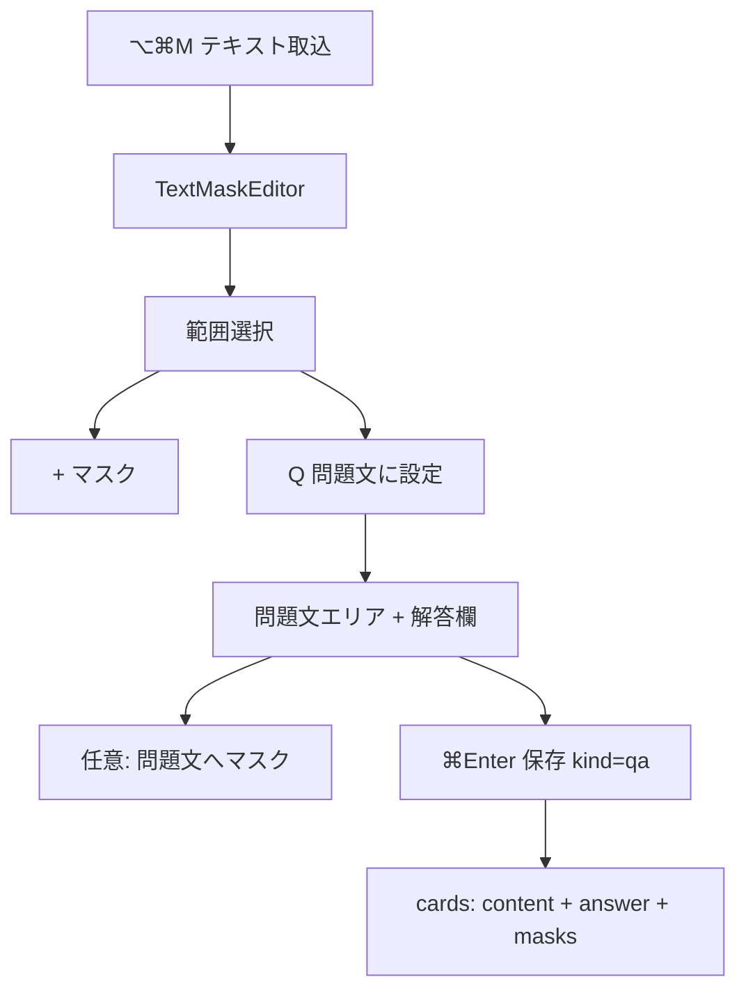

# 一問一答（Q&A）カード追加

## 背景と目標

現行のテキストカード（[`TextMaskEditor.tsx`](xanki/src/components/TextMaskEditor.tsx)）は **1 本文 + 複数 range マスク** のみ。ユーザー要望は:

- 選択範囲を **問題文** に昇格（「Q」ボタン）
- その下に **解答** 入力欄
- 問題文への **マスクは任意**（同時に可能）
- Study タブ **全サブモード** で Q&A を扱う
- 保存条件: **問題文 + 解答必須**、マスク任意（ユーザー確認済み）

## データモデル

### 新カード種別 `qa`

[`cards.kind`](xanki/src-tauri/migrations/001_init.sql) に `qa` を追加（既存 `text` / `image` は変更なし）。

| 列 | Q&A カードでの用途 |
|----|-------------------|
| `content` | 問題文 |
| `answer` | 解答（**新列**） |
| `masks` | 問題文に対する range マスク JSON（空配列 `[]` 可） |

### Migration `003_qa_answer.sql`

```sql
ALTER TABLE cards ADD COLUMN answer TEXT;
```

- 既存行: `answer = NULL`（`text` / `image` は従来どおり）
- 新規 `qa`: `answer NOT NULL` をアプリ層で保証

### 型・API 更新

- [`xanki/src/types/index.ts`](xanki/src/types/index.ts): `Card.kind` に `"qa"`、`answer?: string`
- [`xanki/src-tauri/src/models.rs`](xanki/src-tauri/src/models.rs): `Card.answer`, `SaveQaCardRequest`, `UpdateQaCardRequest`
- [`repos.rs`](xanki/src-tauri/src/db/repos.rs): `save_qa_card`, `update_qa_card`, `CARD_SELECT` に `answer` 追加、export/import 対応
- [`commands/mod.rs`](xanki/src-tauri/src/commands/mod.rs): Tauri コマンド追加
- [`api.ts`](xanki/src/lib/tauri/api.ts): `saveQaCard` / `updateQaCard`
- [`EditorInitPayload`](xanki/src/types/index.ts): `answer?: string`、`mode: "text" | "qa" | "image"`



## Spec 更新（SSoT 先）

新規 [`docs/spec/qa-cards.md`](docs/spec/qa-cards.md) を追加し、以下を更新:

| ファイル | 内容 |
|---------|------|
| [`docs/spec/README.md`](docs/spec/README.md) | 索引に qa-cards 追加 |
| [`docs/spec/data-model.md`](docs/spec/data-model.md) | `answer` 列、`kind=qa` |
| [`docs/spec/text-masks.md`](docs/spec/text-masks.md) | Q&A モードへの切替入口（Q ボタン）を参照 |
| [`docs/spec/study.md`](docs/spec/study.md) | 各サブモードの Q&A 挙動 |
| [`docs/spec/product.md`](docs/spec/product.md) | F4 拡張として Q&A を記載 |
| [`docs/spec/library.md`](docs/spec/library.md) | プレビュー・種別バッジ `Q&A` |

## エディタ UX（[`TextMaskEditor.tsx`](xanki/src/components/TextMaskEditor.tsx)）

### 通常モード（現行）

- 取得全文を 1 textarea
- 選択 → フローティング **「+ マスク」**（現状維持）
- 保存 → `kind=text`（マスク 1 件以上必須）

### Q&A モード（新規）

**トリガー**: 選択範囲がある状態でフローティング **「Q」** を追加（`+ マスク` の隣）

**Q 押下時**:

1. 選択テキストを `question` に設定
2. エディタを Q&A レイアウトへ切替
   - **上**: 問題文（textarea + マスク背景レイヤ、`remapTextMasks` 継続）
   - **下**: 解答（通常 textarea、ラベル「解答」）
3. 選択外テキストは **破棄**（カードに含めない）

**保存**:

- Q&A モード: `saveQaCard({ question, answer, masks, deckId, note })` — **マスク 0 件 OK**
- 通常モード: 従来 `saveTextCard` — マスク必須

**再編集**: [`open_card_editor`](xanki/src-tauri/src/windows/mod.rs) で `kind=qa` → `mode=qa`、`content`/`answer`/`masks` をロード

**UI/CSS**: [`App.css`](xanki/src/App.css) に `.qa-editor-layout`, `.qa-answer-field` 等

## 学習モード（Study タブ全体）

共通コンポーネント [`StudyCardDisplay`](xanki/src/components/study/shared.tsx) を拡張:

| 状態 | Q&A 表示 |
|------|---------|
| 非表示 | 問題文のみ。マスクありなら Chartreuse 塗り |
| 答え表示 | 問題文は **全マスク解除** + 解答ブロックを下に表示 |

### サブモード別

| モード | Q&A 出題ロジック |
|--------|-----------------|
| **フラッシュカード / 学習(SRS)** | 上記 `StudyCardDisplay` の reveal フロー（Space） |
| **書く** | [`extractMaskAnswers`](xanki/src/lib/maskAnswers.ts) に Q&A エントリ追加: prompt=問題文（マスク箇所は `【  】`）、expected=`card.answer`。マスク無し Q&A は prompt=問題文全文 |
| **テスト** | 問題文（マスク反映）を stem、正解=`card.answer`、誤答は他カードの answer から抽出 |
| **マッチ** | 問題文 ↔ `card.answer` のペアタイルを生成（既存 mask ベースと混在可） |

[`maskAnswers.ts`](xanki/src/lib/maskAnswers.ts): `MaskAnswer.kind` に `"qa"` を追加し、各モードの loader を更新。

## ライブラリ

[`LibraryCardPreview.tsx`](xanki/src/components/LibraryCardPreview.tsx):

- `kind=qa`: 問題文（マスク適用プレビュー）+ 解答は非表示（または薄く「解答あり」表示）
- [`LibraryView.tsx`](xanki/src/components/LibraryView.tsx): 種別 pill を `Q&A` に

## 実装順序

1. **Spec** — `qa-cards.md` + 関連 spec 更新
2. **DB migration + Rust models/repos/commands**
3. **Frontend types + api**
4. **TextMaskEditor** — Q ボタン、Q&A レイアウト、保存分岐
5. **StudyCardDisplay + maskAnswers** — 全 Study サブモード
6. **Library preview + open_card_editor**
7. **手動 QA** — spec 受け入れ条件

## 受け入れ条件（QA）

- [ ] ⌥⌘M → 選択 → Q → 解答入力 → ⌘Enter で Q&A カード保存（マスク無しでも可）
- [ ] 問題文にマスク追加 → 保存 → ライブラリ/再編集で位置一致
- [ ] フラッシュカード/学習: 問題文+マスク表示 → Space → マスク解除+解答表示
- [ ] 書く/テスト/マッチ: Q&A カードが出題に含まれる
- [ ] 既存 `text` / `image` カードの挙動に回帰なし

## スコープ外

- 画像カードへの Q&A 拡張
- 問題文/解答のリッチテキスト
- AI による問題自動生成
