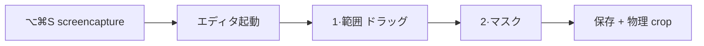
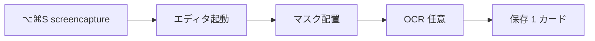

# スクショフロー簡素化（エディタ内 crop 廃止）

## 現状と問題



- OS の `screencapture -i -x` がすでに範囲選択を行う（[docs/spec/capture.md](docs/spec/capture.md)）
- エディタ内の crop（[ImageMaskEditor.tsx](xanki/src/components/ImageMaskEditor.tsx) の `mode === "crop"`、カードタブ、「+ 範囲」）が二重で邪魔
- ユーザー確認: **1 スクショ = 1 カード**（複数範囲 → 複数カードは廃止）

## 目標フロー



- 範囲選択 = **OS のみ**
- エディタ起動直後からマスクモード
- 保存時はキャプチャ PNG をそのまま使用（不要な再 crop を避ける）

## 1. 仕様更新（SSoT 先）

[docs/spec/image-masks.md](docs/spec/image-masks.md) を中心に更新:

| 項目 | 変更 |
|------|------|
| フロー | `crop → マスク` を **`マスク → 保存`** に |
| 1 スクショ | **1 カード**（複数範囲の記述・受け入れ条件を削除） |
| 座標系 | 保存前後とも **キャプチャ PNG 基準**（crop 相対変換は full-image 時のみ no-op） |
| UI | 「1·範囲」タブ、カードタブ、「+ 範囲」、crop 外ディムを削除 |
| 再編集 | 既存カード（旧 crop 済み PNG）の挙動は **変更なし** |

関連: [docs/spec/capture.md](docs/spec/capture.md)（エディタは範囲指定しない旨）、[docs/spec/product.md](docs/spec/product.md)（F5 説明）、[SettingsView.tsx](xanki/src/components/SettingsView.tsx) の文言

## 2. フロントエンド: ImageMaskEditor 簡素化

対象: [xanki/src/components/ImageMaskEditor.tsx](xanki/src/components/ImageMaskEditor.tsx)

### 状態モデル

- `CardDraft` / `cards[]` / `activeCardId` / 複数カード管理を **削除**
- 単一の `masks: ImageMask[]` に置き換え（再編集パスと同型）
- `EditorMode`: `"crop"` を削除 → `"mask" | "ocr"`

### 初期化（新規）

`naturalSize` 確定後（画像 onLoad / layout）:

- `masks = []`
- `mode = "mask"`（現状の再編集 init と同等）

crop 待ちでエディタが操作不能になる問題を解消。

### マウス操作

- `handleMouseUp` の `mode === "crop"` 分岐を削除
- マスク矩形は画像全体 `clampRect(..., naturalSize.w, naturalSize.h)` に直接追加
- `rectInsideCrop` / `wordInsideCrop` を削除（または full bounds 固定）

### UI 削除

- ツールバー `step-switch` の「1 · 範囲」ボタン
- `card-tabs` / 「+ 範囲」 / `removeCard`
- オーバーレイ: `crop-dim-hole`, `crop-overlay`, mask モード時の crop 枠 (`dimRect`)
- `saveCount` → マスク数ベースの単純表示（「1 カード」固定でも可）

### 保存

```typescript
// 新規: 1 region = full image
await api.saveImageCards({
  deckId,
  imagePath,
  ocrText, ocrData,
  regions: [{
    cropX: 0, cropY: 0,
    cropW: naturalSize.w, cropH: naturalSize.h,
    masks,
  }],
});
```

再編集 (`updateImageCard`) は現状維持。

### OCR

- `runOcr` は `activeCard` 不要に
- 全 word をクリック可能（crop フィルタなし）

## 3. バックエンド: 冗長 crop の回避（推奨）

対象: [xanki/src-tauri/src/commands/mod.rs](xanki/src-tauri/src/commands/mod.rs) `save_image_cards`

full-image region（`crop_x/y == 0` かつ `crop_w/h` ≒ 画像サイズ）のとき:

- `crop_image` を **スキップ**し `source_image` をそのまま DB に保存
- `adjust_region_for_crop` は no-op だが呼んでも問題なし（座標不変）

実装案: `crop_image` 前に `image::open` で source サイズを取得し、region が全画面なら `cropped = source_image.clone()`。

既存カード（すでに crop 済み PNG + crop 相対 masks）への **マイグレーション不要**。

## 4. CSS 整理（任意・小）

[xanki/src/App.css](xanki/src/App.css) から未使用になる crop 専用スタイル（`.crop-dim-hole`, `.crop-overlay`, `.card-tabs` 等）を削除または残置。エディタ以外で未使用なら削除。

## 5. 受け入れ条件（QA）

- [ ] ⌥⌘S → エディタが **即マスク可能**（範囲ステップなし）
- [ ] マスク配置 → Enter 保存 → ライブラリ/再編集で位置一致
- [ ] OCR マスクが full image で動作
- [ ] **既存**の crop 済みカードを再編集しても問題なし
- [ ] 設定画面のスクショ説明が新フローと一致

## 変更ファイル一覧

| ファイル | 変更内容 |
|---------|---------|
| [docs/spec/image-masks.md](docs/spec/image-masks.md) | フロー・座標・UI・受け入れ条件 |
| [docs/spec/capture.md](docs/spec/capture.md) | エディタ役割の明確化 |
| [ImageMaskEditor.tsx](xanki/src/components/ImageMaskEditor.tsx) | 主な実装 |
| [commands/mod.rs](xanki/src-tauri/src/commands/mod.rs) | full-image 時 crop スキップ |
| [SettingsView.tsx](xanki/src/components/SettingsView.tsx) | 説明文言 |
| [App.css](xanki/src/App.css) | 未使用 crop UI（任意） |

## スコープ外

- OS `screencapture` 自体の変更
- 既存 DB カードのデータ移行
- テキストマスクエディタ
