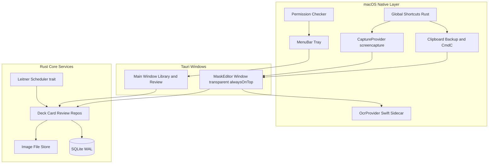
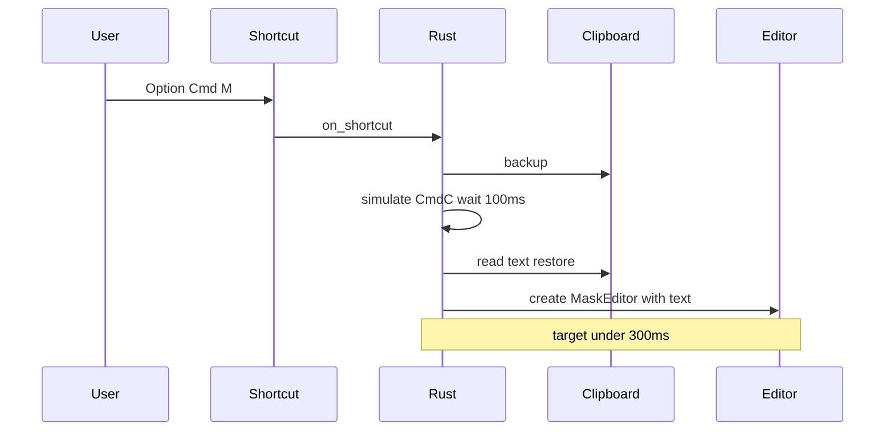

# xanki MVP 開発計画

## 現状

- [xanki/](xanki/) に Tauri 2.11 + React 19 + Vite 8 のデフォルトテンプレートのみ存在
- Rust 側は `greet` コマンド1つのみ ([xanki/src-tauri/src/lib.rs](xanki/src-tauri/src/lib.rs))
- フロントはボイラープレート ([xanki/src/App.tsx](xanki/src/App.tsx))
- 設計書の F1〜F9、DB、SRS、OCR サイドカーはすべて未着手

## アーキテクチャ



### ウィンドウ構成 (3種)

| ウィンドウ | 役割 | 設定要点 |
|-----------|------|---------|
| Tray | メニューバー常駐。「今日の復習: N件」、ライブラリ/設定/終了 | `tauri.conf.json` でメインウィンドウを起動時非表示、`trayIcon` 有効化 |
| MaskEditor | 取込のたびに生成。透過・最前面・装飾なし | `alwaysOnTop`, `decorations: false`, `transparent: true`, 専用 Vite エントリ or ルート `/editor` |
| Main | ライブラリ・復習・設定・オンボーディング | 通常ウィンドウ。閉じても Tray 常駐 |

### 推奨ディレクトリ構成

```
xanki/
├── src/
│   ├── windows/
│   │   ├── main/          # ライブラリ・復習・設定
│   │   └── mask-editor/   # テキスト/画像マスク UI
│   ├── components/
│   ├── stores/            # Zustand (editorState, reviewQueue, settings)
│   ├── lib/tauri/         # invoke ラッパー型安全化
│   └── types/             # Card, Mask, Deck 等 (Rust と共有 serde 型を mirror)
├── src-tauri/
│   ├── src/
│   │   ├── lib.rs
│   │   ├── state.rs       # AppState (DB pool, settings)
│   │   ├── commands/      # cards, decks, capture, import, review, permissions
│   │   ├── db/            # migrations, repos
│   │   ├── capture/       # CaptureProvider trait + ScreencaptureProvider
│   │   ├── clipboard/     # backup, simulate_copy, restore
│   │   ├── scheduler/     # Scheduler trait + LeitnerScheduler
│   │   ├── image_store/
│   │   └── permissions/   # accessibility, screen_recording 状態検知
│   └── sidecar/
│       └── ocr/           # Swift CLI (Vision) → JSON
```

---

## 追加依存 (Cargo / npm)

**Rust ([xanki/src-tauri/Cargo.toml](xanki/src-tauri/Cargo.toml))**

- `tauri-plugin-global-shortcut` — ⌥⌘M / ⌥⌘S
- `tauri-plugin-clipboard-manager` — クリップボード退避・復元
- `rusqlite` + `uuid` (v7) — DB
- `arboard` (clipboard プラグインで不足時) / `enigo` または `core-graphics` + `core-foundation` — ⌘C 送出
- `tokio` — 非同期キャプチャ・OCR サブプロセス

**npm ([xanki/package.json](xanki/package.json))**

- `zustand` — 状態管理
- `react-router-dom` — Main / Editor ウィンドウ間ルーティング
- `@tauri-apps/plugin-global-shortcut`, `@tauri-apps/plugin-notification` (トースト用)

---

## フェーズ別実装 (設計書 §11 準拠)

### W1: 技術スパイク (機能開発より優先)

各スパイクは捨てコード可。結果を設計書 §10 に追記する。

| # | スパイク | 実装方針 | 合格基準 (§7) |
|---|---------|---------|--------------|
| S1 | グローバルショートカット | Tray 常駐 + `tauri-plugin-global-shortcut` で ⌥⌘M/S 登録。他アプリ前面でも発火確認 | 常駐中に確実発火。競合時は設定画面で変更可能にする余地を残す |
| S2 | ⌘C + クリップボード退避 | `clipboard` 退避 → CGEvent/enigo で ⌘C → 50〜150ms 待機 → 読取 → 復元 | Safari/Chrome/Preview/Notion で成功率計測。**300ms 以内**にエディタ表示 |
| S3 | 透過・最前面ウィンドウ | `WebviewWindowBuilder` で MaskEditor プロトタイプ。マルチディスプレイ/Spaces 確認 | ショートカット後すぐ表示。フォーカス・キーボード入力が効く |
| S4 | Vision OCR サイドカー | Swift CLI: 画像パス → `{ words: [{ id, text, bbox }] }` JSON | 日本語教材スクショで単語 bbox が取れる。Rust から `Command::new` で呼び出し |

**W1 完了条件**: 4点すべて実測値を記録し、§7 目標に対して Go/No-Go 判定。



---

### W2: テキスト取込 → 保存 → 一覧

**Rust**

1. DB 初期化: 設計書 §6 のスキーマ + WAL モード + `migrations/001_init.sql`
2. リポジトリ層: `DeckRepository`, `CardRepository`, `ReviewStateRepository` (将来同期用に集約)
3. Tauri commands: `list_decks`, `create_deck`, `save_text_card`, `list_cards`, `search_cards`
4. テキスト取込フロー: S2 完成版 + 失敗時 `notification` で ⌥⌘S 誘導
5. Tray: 「ライブラリを開く」、デフォルトデッキ自動作成

**Frontend**

1. MaskEditor (テキストモード): テキスト表示、ドラッグ範囲選択 → マスク追加 (複数)、デッキ選択、メモ、`Enter` 保存 / `Esc` 破棄
2. Main ライブラリ: デッキ一覧 → カード一覧、検索 (content/note)、編集・削除
3. `masks` JSON: `[{ "type": "range", "start", "end }]`

**完了条件**: 自分の SAA 学習素材からテキストカードを作成・一覧表示できる。

---

### W3: スクショ取込 + 矩形マスク

**Rust**

1. `CaptureProvider` trait 定義 + `ScreencaptureProvider` (`screencapture -i -x`)
2. キャプチャ後 App Data (`app_data_dir/images/{uuid}.png`) へ移動
3. 画像カード保存: 矩形マスク JSON + `image_path` (相対パス)
4. **範囲分割**: エディタから複数 crop 領域を受け取り、範囲ごとに1カード生成 (設計書 §5.4)

**Frontend**

1. MaskEditor (画像モード): `<canvas>` または SVG オーバーレイで矩形ドラッグ、赤系デフォルト、複数矩形
2. 「範囲」概念 UI: 矩形をグループ化し、グループごとに別カードとして保存

**完了条件**: PDF/スライドのスクショから矩形マスク付き画像カードが作れる。

---

### W4: 復習モード + Leitner SRS

**Rust**

1. `Scheduler` trait + `LeitnerScheduler` (箱1〜5、§5.6 の間隔)
2. `get_due_cards`, `submit_review(result: 0|1)`, `review_logs` 記録
3. Tray メニューに「今日の復習: N件」動的更新 (イベント `review-count-changed`)

**Frontend**

1. 復習画面: マスク ON → `Space` で OFF → `1`(できない) / `2`(できた)
2. テキスト: マスク範囲を塗りつぶし矩形描画
3. 画像: マスク矩形オーバーレイ
4. キーボードのみで連続復習可能 (フォーカス管理必須)

**完了条件**: 毎朝「今日の復習」が回せる。

---

### W5: OCR 文字マスク + 権限ウィザード + 磨き込み

**OCR (未決事項の推奨解決)**

- OCR 結果 JSON を `cards.ocr_data` カラム (TEXT, JSON) として同梱保存
- `masks` 内 `"type": "ocr", "wordIds": [4,5,6]` は `ocr_data.words[id]` を参照
- 検索 (F6) は `ocr_text` (プレーン全文) + `content`/`note` を LIKE 検索

**Rust / Swift**

1. OCR サイドカー本番組み込み (`OcrProvider` trait)
2. 権限検知: Accessibility / Screen Recording 状態を Rust で polling or 初回チェック
3. オンボーディングウィザード用 commands

**Frontend**

1. オンボーディング (F9): 3ステップ (アクセシビリティ → 画面収録 → ショートカット練習)
2. 設定画面: 権限再誘導、ショートカット表示、マスク色
3. OCR モード: 「文字を認識」→ bbox 上でドラッグ選択マスク
4. パフォーマンス: 保存はバックグラウンド、エディタは **200ms 以内**に閉じる (§7)
5. `MaskSuggester` インターフェース定義のみ (no-op 実装) — 将来 AI 用フック (§9)

**完了条件**: 他人の Mac に入れて 5 分で使い始められる。

---

## データ層の要点

設計書 §6 をそのまま採用。追加推奨:

```sql
-- OCR 全文検索 + word bbox 参照用 (W5)
ALTER TABLE cards ADD COLUMN ocr_data TEXT;  -- JSON: { words: [...] }
```

- 主キー: UUID v7 (時系列ソート可能、将来同期向け)
- 論理削除 `deleted_at` は MVP では UI 非表示だがクエリでは常に `deleted_at IS NULL`
- 画像は DB に BLOB せず `app_data_dir/images/` + 相対パス

---

## Tauri 設定変更 ([xanki/src-tauri/tauri.conf.json](xanki/src-tauri/tauri.conf.json))

- `app.windows[0].visible: false` — 起動時 Tray のみ
- `trayIcon` 追加
- MaskEditor 用ウィンドウラベルは Rust 側 `WebviewWindowBuilder` で動的生成 (設定ファイルには Main のみ)
- `macOSPrivateApi: true` (透過ウィンドウに必要な場合)
- capabilities に global-shortcut, clipboard, notification 権限追加

---

## 非機能要件チェックリスト

| 項目 | 目標 | 検証方法 |
|------|------|---------|
| テキスト取込レイテンシ | 300ms | W1 S2 で `Instant::now()` 計測ログ |
| スクショ UI 表示 | 500ms | W1/W3 で計測 |
| 保存→エディタ閉じ | 200ms | W2 から UI 先閉じ + 非同期 persist |
| 常駐メモリ | 150MB | Activity Monitor (アイドル時) |
| ネットワーク | ゼロ | コードレビュー + `reqwest` 等禁止 |

---

## リスクと対策

| リスク | 対策 |
|--------|------|
| ⌘C 送出が特定アプリで失敗 | トーストで ⌥⌘S 誘導 (設計書 §5.1)。権限未付与も同様 |
| 透過ウィンドウの Tauri 2 制限 | W1 S3 で早期検証。ダメなら半透明+blur フォールバック |
| OCR wordIds の参照切れ | OCR 結果をカードに同梱 (`ocr_data`)。再 OCR は将来機能 |
| App Store 配布不可 | MVP は署名+notarize 済み dmg 手動配布 (§12)。W5 末尾で調査 |
| ショートカット競合 | 設定画面で変更可能にする余地を W1 で確保 |

---

## 実装順序 (推奨タスク依存)

```mermaid
flowchart LR
  W1Spike[W1 Spikes] --> W2DB[W2 DB and Repos]
  W2DB --> W2Import[W2 Text Import]
  W2Import --> W2Editor[W2 MaskEditor Text]
  W2Editor --> W2Library[W2 Library UI]
  W2Library --> W3Capture[W3 Screenshot]
  W3Capture --> W3ImageEditor[W3 Image MaskEditor]
  W3ImageEditor --> W4SRS[W4 Leitner]
  W4SRS --> W4Review[W4 Review UI]
  W4Review --> W5OCR[W5 OCR Sidecar]
  W5OCR --> W5Onboard[W5 Onboarding]
  W5Onboard --> W5Polish[W5 Polish]
```



最初に着手するファイル:

1. [xanki/src-tauri/src/lib.rs](xanki/src-tauri/src/lib.rs) — Tray、AppState、プラグイン登録
2. `src-tauri/src/db/` — マイグレーション + リポジトリ
3. `src-tauri/src/clipboard/` — W1 S2 スパイク
4. `src/windows/mask-editor/` — コア UX
