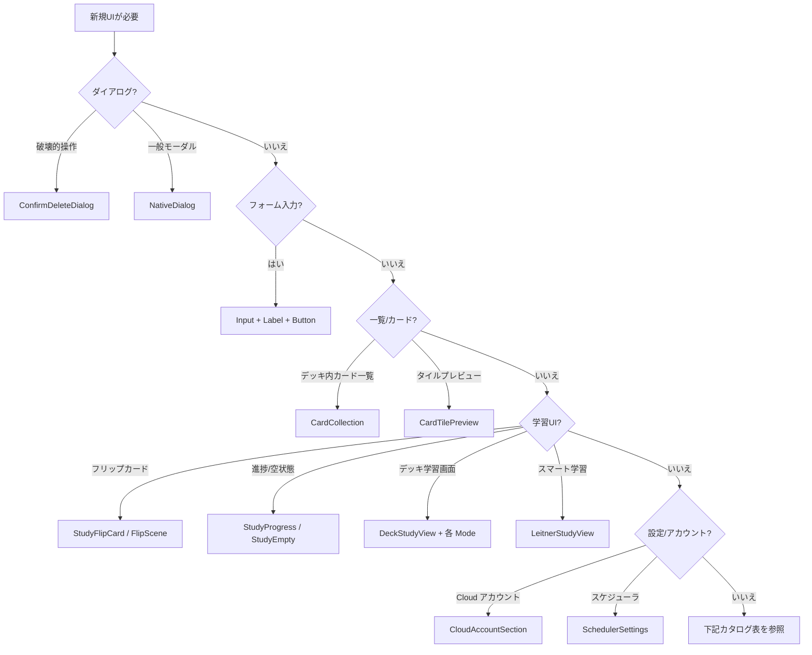

# UI コンポーネントカタログ

**新規 UI を作る前に必ず本ドキュメントを読む。** 既存コンポーネントの再実装を禁止する。

スタイル規約: [ui.md](./ui.md) §Interaction States、[`focus.css`](../../packages/ui/src/styles/focus.css)、[`tokens.css`](../../packages/ui/src/styles/tokens.css)。検証: `pnpm check:design`。

## Decision tree

## Primitives

最小 UI 部品。新規ボタン・入力・ダイアログはこれらを compose する。

| コンポーネント | パス | 使う条件 | 再作成禁止 |
|---------------|------|----------|-----------|
| `Button` | [`components/ui/button.tsx`](../../packages/ui/src/components/ui/button.tsx) | 任意のボタン。variant: `accent` / `ghost` / `text` / `icon` / `destructive` | 独自 `<button>` + ad-hoc CSS |
| `Input` | [`components/ui/input.tsx`](../../packages/ui/src/components/ui/input.tsx) | テキスト入力 1 行 | 素の `<input>` + ローカルスタイル |
| `Label` | [`components/ui/label.tsx`](../../packages/ui/src/components/ui/label.tsx) | フォームラベル | 独自 label スタイル |
| `NativeDialog` | [`components/ui/native-dialog.tsx`](../../packages/ui/src/components/ui/native-dialog.tsx) | モーダル全般（AI パネル、確認以外） | Radix Dialog の新規導入、`
` オーバーレイ |
| `Toaster` | [`components/ui/sonner.tsx`](../../packages/ui/src/components/ui/sonner.tsx) | トースト通知 | 独自 toast 実装 |

## Patterns

画面横断で再利用する合成 UI。

| コンポーネント | パス | 使う条件 | 再作成禁止 |
|---------------|------|----------|-----------|
| `ConfirmDeleteDialog` | [`confirm-delete-dialog.tsx`](../../packages/ui/src/components/xanki/confirm-delete-dialog.tsx) | カード・デッキ等の削除確認 | `window.confirm`、独自削除ダイアログ |
| `CloudAccountSection` | [`cloud-account-section.tsx`](../../packages/ui/src/components/xanki/cloud-account-section.tsx) | 設定の Cloud アカウント表示 | 設定画面内のアカウント UI 直書き |
| `BillingSection` | 同上 | プラン・課金表示 | 同上 |
| `SchedulerSettings` | [`scheduler-settings.tsx`](../../packages/ui/src/components/xanki/scheduler-settings.tsx) | Leitner スケジューラ設定フォーム | 設定画面内の scheduler UI 再実装 |
| `CollectionAddBar` | [`collection-add-bar.tsx`](../../packages/ui/src/components/xanki/collection-add-bar.tsx) | デッキ内カード追加バー | 取込ボタン行の再実装 |
| `CardTilePreview` | [`card-tile-preview.tsx`](../../packages/ui/src/components/xanki/card-tile-preview.tsx) | カード 1 枚のプレビュータイル | カードサムネイル UI の再実装 |
| `CardCollection` | [`card-collection.tsx`](../../packages/ui/src/components/xanki/card-collection.tsx) | デッキ内カード一覧（検索・削除含む） | カードグリッド + 削除の再実装 |
| `HomeMetricsPanel` | [`home-metrics-panel.tsx`](../../packages/ui/src/components/xanki/home-metrics-panel.tsx) | ホームの学習メトリクス | メトリクスカード UI の再実装 |
| `BootstrapLoading` / `EditorLoading` | [`loading-views.tsx`](../../packages/ui/src/components/xanki/loading-views.tsx) | 起動中・エディタ読込中 | スピナー / プレースホルダの再実装 |
| `Dock` | [`motion/dock.tsx`](../../packages/ui/src/components/motion/dock.tsx) | 学習手段選択（macOS Dock 風） | 手段ボタン列の再実装 |
| `FadeSlide` / `MotionFade` | [`motion/fade-slide.tsx`](../../packages/ui/src/components/motion/fade-slide.tsx) | fade / slide アニメ | アプリ側から `motion/react` 直接 import |
| `AiCardGenerateDialog` | [`mask/ai-card-generate-dialog.tsx`](../../packages/ui/src/components/xanki/mask/ai-card-generate-dialog.tsx) | AI カード一括生成（テキスト / 画像） | 学習ハブ・マスクエディタ内 AI ダイアログ再実装 |
| `StudyAiPanel` | [`study/study-ai-panel.tsx`](../../packages/ui/src/components/xanki/study/study-ai-panel.tsx) | 学習中 AI 補助 | 学習セッション内 AI ダイアログ再実装 |

## Screens

画面単位。Web / Tauri は thin wrapper + `AppApi` 注入のみ。

| コンポーネント | パス | 使う条件 | 再作成禁止 |
|---------------|------|----------|-----------|
| `AppShell` | [`app-shell.tsx`](../../packages/ui/src/components/xanki/app-shell.tsx) | メインシェル（サイドレール + トップバー） | web/xanki 側の shell 再実装 |
| `HomeView` | [`home-view.tsx`](../../packages/ui/src/components/xanki/home-view.tsx) | ホーム（デッキ一覧） | ホーム画面の再実装 |
| `DeckStudyView` | [`study/deck-study-view.tsx`](../../packages/ui/src/components/xanki/study/deck-study-view.tsx) | デッキ学習ハブ + セッション | 学習ハブ UI 再実装 |
| `LeitnerStudyView` | [`study/leitner-study-view.tsx`](../../packages/ui/src/components/xanki/study/leitner-study-view.tsx) | スマート学習ハブ + セッション | 同上 |
| `SettingsView` | [`settings-view.tsx`](../../packages/ui/src/components/xanki/settings-view.tsx) | 設定タブ | 設定画面再実装 |
| `LoginView` | [`login-view.tsx`](../../packages/ui/src/components/xanki/login-view.tsx) | ログイン | Web/Tauri 別ログイン UI |
| `OnboardingView` | [`onboarding-view.tsx`](../../packages/ui/src/components/xanki/onboarding-view.tsx) | 初回オンボーディング | オンボーディング再実装 |

## Study

学習セッション UI。新モード追加時は既存 Mode を template にする。

| コンポーネント | パス | 使う条件 | 再作成禁止 |
|---------------|------|----------|-----------|
| `FlashcardsMode` | [`study/flashcards-mode.tsx`](../../packages/ui/src/components/xanki/study/flashcards-mode.tsx) | フラッシュカード手段 | 新規 flip UI |
| `LearnMode` | [`study/learn-mode.tsx`](../../packages/ui/src/components/xanki/study/learn-mode.tsx) | 復習（learn）手段 | 同上 |
| `TestMode` | [`study/test-mode.tsx`](../../packages/ui/src/components/xanki/study/test-mode.tsx) | テスト手段 | 同上 |
| `WriteMode` | [`study/write-mode.tsx`](../../packages/ui/src/components/xanki/study/write-mode.tsx) | 記述手段 | 同上 |
| `MatchMode` | [`study/match-mode.tsx`](../../packages/ui/src/components/xanki/study/match-mode.tsx) | マッチング手段 | 同上 |
| `StudyFlipCard` / `FlipScene` | [`study/study-flip-scene.tsx`](../../packages/ui/src/components/xanki/study/study-flip-scene.tsx) | カードフリップ表示 | 3D flip の再実装 |
| `StudyCardDisplay` | [`study/study-card-display.tsx`](../../packages/ui/src/components/xanki/study/study-card-display.tsx) | 学習カード本文表示 | カードレンダラ再実装 |
| `StudyCardCoverflow` | [`study/study-card-coverflow.tsx`](../../packages/ui/src/components/xanki/study/study-card-coverflow.tsx) | 学習ハブ Coverflow | Coverflow 再実装 |
| `StudyProgress` | [`study/study-progress.tsx`](../../packages/ui/src/components/xanki/study/study-progress.tsx) | セッション進捗バー | 進捗 UI 再実装 |
| `StudyEmpty` | 同上 | カード 0 件・完了空状態 | 空状態パネル再実装 |
| `LeitnerDueCompletePanel` | [`study/leitner-due-complete-panel.tsx`](../../packages/ui/src/components/xanki/study/leitner-due-complete-panel.tsx) | スマート学習完了演出 | 完了画面再実装 |
| `LeitnerDeckSessionComplete` | [`study/leitner-deck-session-complete.tsx`](../../packages/ui/src/components/xanki/study/leitner-deck-session-complete.tsx) | デッキ単位 Leitner 完了 | 同上 |
| `MaskedTextSpan` | [`study/masked-text-span.tsx`](../../packages/ui/src/components/xanki/study/masked-text-span.tsx) | マスク付きテキスト span | マスク表示 span 再実装 |
| `renderTextWithMasks` 等 | [`study/study-text-masks.tsx`](../../packages/ui/src/components/xanki/study/study-text-masks.tsx) | マスク描画ユーティリティ | マスク HTML 生成の再実装 |

## Mask / Editor

| コンポーネント | パス | 使う条件 | 再作成禁止 |
|---------------|------|----------|-----------|
| `TextMaskEditor` | [`mask/text-mask-editor.tsx`](../../packages/ui/src/components/xanki/mask/text-mask-editor.tsx) | テキストマスクエディタウィンドウ | エディタ UI 再実装 |
| `TextMaskComposerEmbedded` | [`mask/text-mask-composer.tsx`](../../packages/ui/src/components/xanki/mask/text-mask-composer.tsx) | 埋め込みマスク作成 | composer 再実装 |
| `ImageMaskEditor` | [`mask/image-mask-editor.tsx`](../../packages/ui/src/components/xanki/mask/image-mask-editor.tsx) | 画像マスクエディタ | 同上 |
| `ImageWithMaskOverlays` | [`mask/image-with-mask-overlays.tsx`](../../packages/ui/src/components/xanki/mask/image-with-mask-overlays.tsx) | 画像 + マスク overlay | overlay 描画再実装 |

## Context / Hooks

| 名前 | パス | 用途 |
|------|------|------|
| `AppApiProvider` / `useAppApi` | [`context/app-api-context.tsx`](../../packages/ui/src/context/app-api-context.tsx) | データ操作 API 注入 |
| `AppShellProvider` / `useAppShell` | [`context/app-shell-context.tsx`](../../packages/ui/src/context/app-shell-context.tsx) | シェル状態 |
| `useMainAppState` | [`hooks/use-main-app-state.ts`](../../packages/ui/src/hooks/use-main-app-state.ts) | メインアプリ状態 |
| `useReducedMotion` | [`lib/use-reduced-motion.ts`](../../packages/ui/src/lib/use-reduced-motion.ts) | reduced motion 検出 |

## 新規 UI 追加手順

1. 本カタログ + [ui.md](./ui.md) で既存コンポーネントを検索
2. 該当があれば compose / extend。なければ `@xanki/ui` に追加
3. border / focus は [`tokens.css`](../../packages/ui/src/styles/tokens.css) + [`focus.css`](../../packages/ui/src/styles/focus.css) 遵守
4. 追加したコンポーネントを **同じ PR で本カタログに追記**
5. `pnpm check:design` 通過

## 受け入れ条件

- [ ] 新規 UI PR で本カタログまたは既存コンポーネントへの参照がある
- [ ] `web/` / `xanki/` に同等 presentational コンポーネントが増えていない
- [ ] `pnpm check:design` が通る
